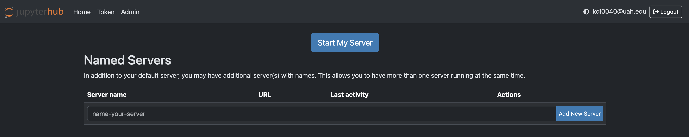
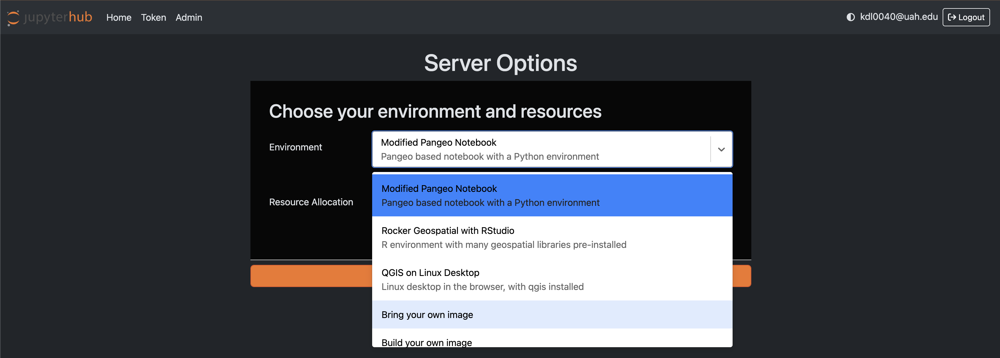
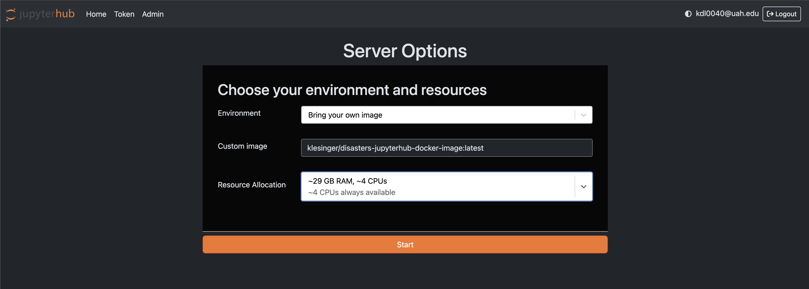

## Overview

This guide walks you through loading a custom Docker image in the Disasters JupyterHub environment.

## Steps to Load Custom Image

### 1. Login to JupyterHub

Navigate to [https://hub.disasters.2i2c.cloud/](https://hub.disasters.2i2c.cloud/) and log in with your credentials.

### 2. Select My Server

After logging in, you'll see the server management screen. Click on "Start My Server" or manage your existing servers.



### 3. Choose Environment

In the Server Options page, locate the **Environment** dropdown and select **"Bring your own image"**.



### 4. Enter Custom Image

In the **Custom image** field, enter the following Docker image:

```
klesinger/disasters-jupyterhub-docker-image
```



### 5. Start Server

Click the **Start** button to launch your JupyterHub server with the custom Disasters image.

## Running Sentinel-2 Algorithms

Once your server is running, you can process Sentinel-2 data using the pre-configured workflows.

### Access the Sentinel-2 Workflow

1. Navigate to the **shared-readwrite** directory in your JupyterHub file browser
2. Open the **process_sentinel2** directory
3. Launch the **sentinel2_workflow.ipynb** notebook
4. Configure the notebook parameters as needed for your specific use case
5. Run the cells to process Sentinel-2 imagery

The workflow notebook contains pre-configured algorithms for common Sentinel-2 data processing tasks.
